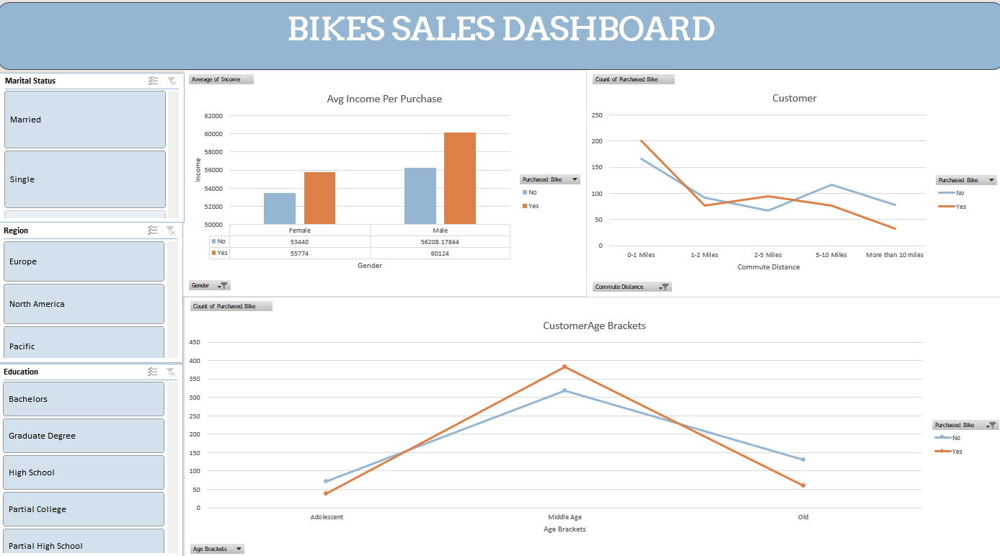

# Bike-Sales-Analysis
## Project Overview
The Bike Sales Dashboard is an interactive Excel dashboard created to analyse customer
purchasing behavior and identify the factors influencing bike purchases. The project uses
customer demographic and lifestyle data to uncover trends related to income, age, commuting
distance, education level, marital status, and region.
The dashboard helps businesses understand which customer segments are more likely to
purchase bikes and supports data-driven decision-making for marketing and sales strategies.

## Objectives
The primary objective of this project is to analyse customer data and identify patterns among
individuals who purchase bikes. The analysis focuses on answering questions such as:
• Do customers with higher incomes purchase more bikes?
• How does commuting distance affect bike purchases?
• Which age groups are more likely to buy bikes?
• Does education level influence bike purchasing behaviour?
• How do marital status and region impact sales?

## Tools Used
• Microsoft Excel
• Pivot Tables
• Pivot Charts
• Slicers
• Data Cleaning and Transformation
• Dashboard Design

# Dashboard Features

Income Analysis
Analysed the average income of customers based on gender and bike purchase status.
Key Insight:
Customers who purchased bikes generally have higher average incomes compared to those who
did not purchase bikes.

Commute Distance Analysis
Examined the relationship between commuting distance and bike purchases.
Key Insight:
Customers traveling shorter distances are more likely to purchase bikes, while bike purchases
decrease as commuting distance increases.

Age Group Analysis
Customers were categorized into age brackets such as Adolescent, Middle Age, and Old
Key Insight:
Middle-aged customers represent the largest group of bike buyers.

Interactive Filtering
Added slicers for:
• Marital Status
• Region
• Education Level
These filters allow users to dynamically explore the data and analyze specific customer
segments.

## Dashboard Preview
\

# Key Findings
• Higher-income customers show a greater tendency to purchase bikes.
• Middle-aged individuals are the most active bike buyers.
• Customers with shorter commute distances purchase bikes more frequently.
• Bike purchasing behavior varies across different educational backgrounds, regions, and
marital statuses.
• Interactive slicers make the dashboard easy to use and support deeper analysis.
